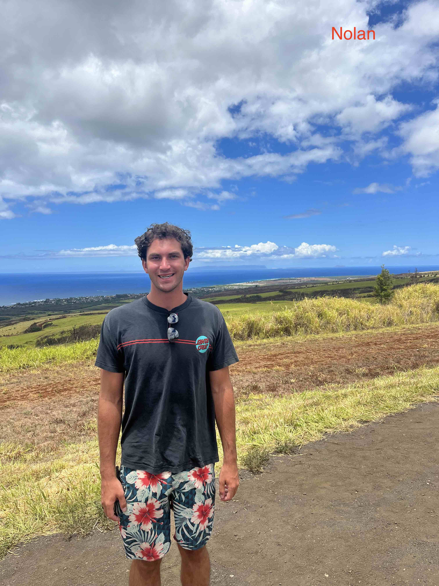
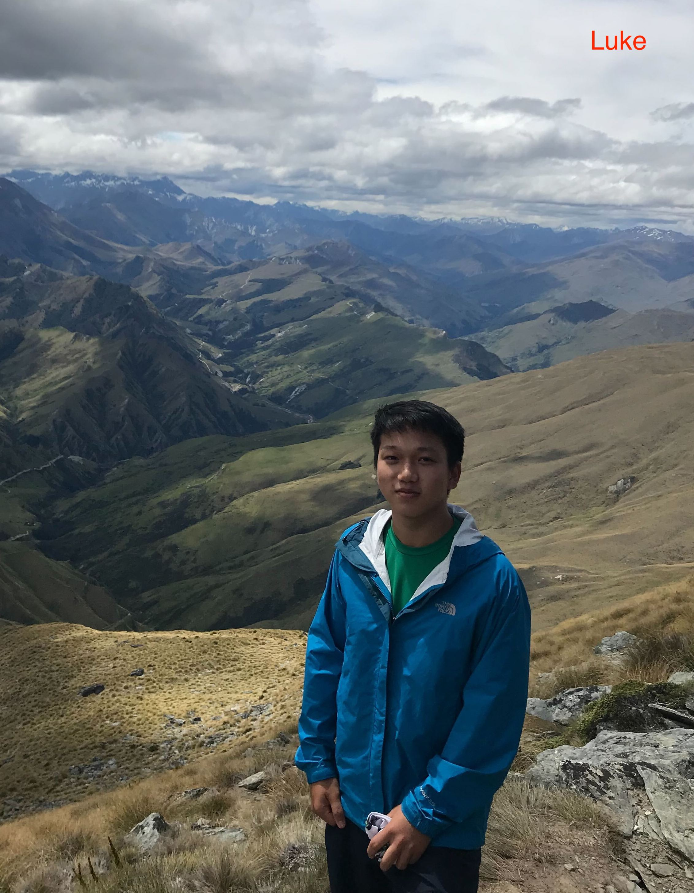

## Staff and office hours 

In Fall 2024 we are running two sections of the class and we are experimenting with a new format: the sections will join for the lectures and will have separate labs. 

* Lectures:  MW 10:05-11:30 (both section A and B) 
* Lab A: F 10:05-11:30 
* Lab B: F 11:40-1:05

Instructors: Cibele Freire and Laura Toma 

We have a wonderful group of LAs this semester who are all excited to be part of the team: Rafael Almeida, Nolan Bessire, Addison Davis	, Victoria Figueroa, Yassine Khayati	,  Vaishali Miriyagalla,  Sebastian Sanchez	and Luke Shaw. If enthusiasm for learning is large, we may be able to convince Professor Majercik to join us, as he has in the past. 
	
|  |   |  |  |     |  |   |  |

LAs office hours: 

| Sundays      |   |   | 
| Mondays      |   |   |
| Tuesdays     |   |   |
| Wednesdays   |   |   |
| Thursdays    |   |   |
| Fridays      |   |   | 
| Saturdays    |   |   | 

Instructors office hours:
 * Cibele: tbd, Searles xxx
 * Laura:  tbd, Searles 219 

Occasional changes to this schedule  will be posted on Slack. 
