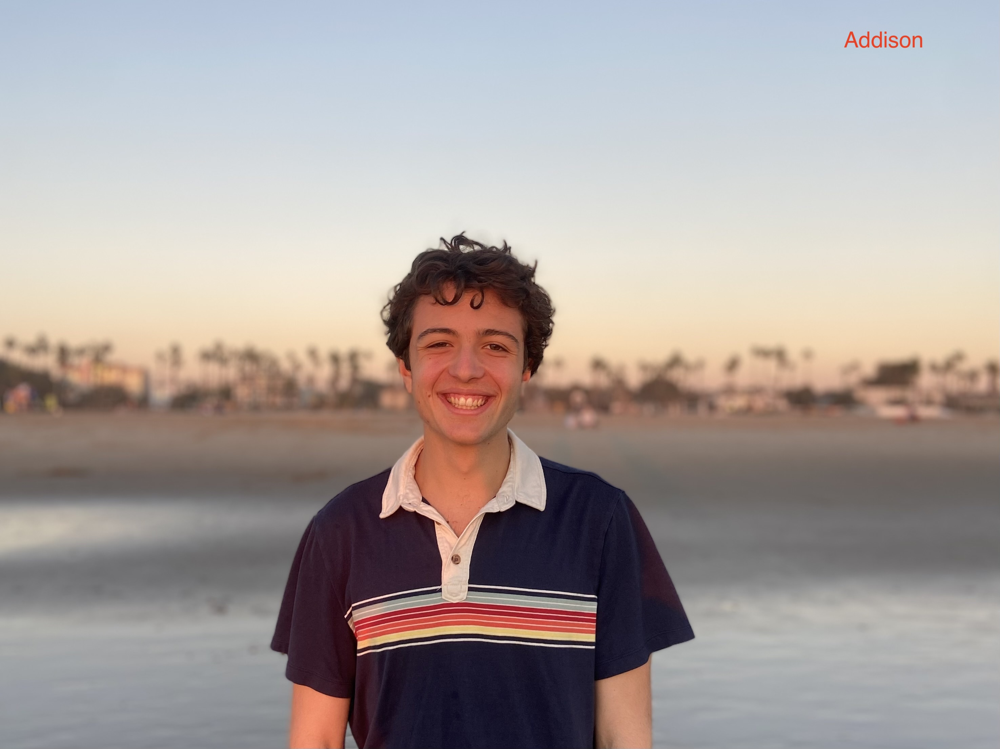

## Staff and office hours 

Instructors: [Cibele Freire](https://www.bowdoin.edu/profiles/faculty/cfreire/index.html) (Searles 121) and [Laura Toma](https://tildesites.bowdoin.edu/~ltoma/)  (Searles 219)

We have a wonderful group of LAs this semester: Rafael Almeida, Nolan Bessire, Addison Davis, Victoria Figueroa, Yassine Khayati,  Vaishali Miriyagalla,  Sebastian Sanchez and Luke Shaw. If enthusiasm for learning is large, we may be able to convince Professor Majercik to join us, as he has in the past. 
	
|  |   |  |  |     |  |    |

LAs office hours: 

| Sundays      |  1-3pm (Yassine) and 7-9pm (Addison) |   | 
| Mondays      |  7-9pm (Nolan) |   |
| Tuesdays     |  7-9pm (Luke)  |   |
| Wednesdays   |  7-9pm Vaishali and Sebastian |   |
| Thursdays    | -  |   |
| Fridays      | -  |   | 
| Saturdays    |  - |   | 

Instructors office hours:
 * Cibele: Mon 11:30-1:30, Searles 121
 * Laura:  Wed 3-5pm, Searles 219 

Occasional changes to this schedule  will be posted on Slack. 
